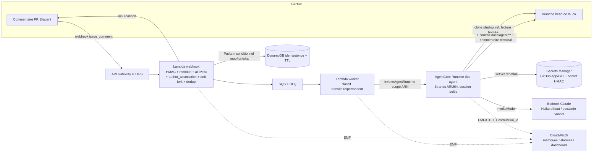

# Design — agent-technical-doc

## 1. Vue d'ensemble

Agent headless sur AWS Bedrock AgentCore Runtime (Python/Strands, conteneur
ARM64), déclenché par un `@mention` dans un commentaire de PR GitHub. Une chaîne
d'ingestion serverless (API Gateway → Lambda webhook → SQS → Lambda worker)
authentifie et achemine l'événement jusqu'à `InvokeAgentRuntime`. L'agent clone
le dépôt en lecture seule, l'analyse statiquement, génère la documentation
(Markdown + `.drawio`), la commite en un seul commit sur la branche de la PR et
poste un commentaire terminal.

Le socle réutilise les conventions du projet `competency-agentic` : discovery des
agents par `agents.json`, build/push ARM64 piloté par Terraform (`build.tf` +
`build_push.sh`), runtime référencé par digest ECR, observabilité par Delivery API
CloudWatch. Contrairement aux agents existants, celui-ci **n'utilise ni Memory ni
Knowledge Base** et ajoute un accès Secrets Manager + une table DynamoDB
d'idempotence + une chaîne d'ingestion.

## 2. Architecture



### 2.1 Flux nominal

1. Un collaborateur commente `@agent-technical-doc` sur une PR.
2. GitHub envoie l'événement `issue_comment` (action `created`) à l'API Gateway.
3. La **Lambda webhook** valide la signature HMAC, vérifie le handle mentionné,
   l'allowlist du dépôt, l'`author_association`, rejette les forks, calcule la clé
   d'idempotence `repo#pr#sha` et fait un `PutItem` conditionnel dans DynamoDB. Si
   la clé est nouvelle : elle pose une réaction d'accusé (👀) et enfile un message
   SQS. Sinon : elle ignore (doublon).
4. La **Lambda worker** consomme le message SQS et appelle `InvokeAgentRuntime`
   (runtime scopé par ARN), en propageant le `correlation_id`.
5. L'**agent** (session microVM isolée) : récupère le token GitHub depuis Secrets
   Manager, clone la ref head en shallow, sélectionne et lit un ensemble borné de
   fichiers, analyse (LLM), génère les `.md` et `.drawio`, commite le tout en un
   seul commit sous `docs/agent/**`, poste un commentaire récapitulatif.
6. En cas d'échec à toute étape : l'agent poste un **commentaire terminal d'échec**
   explicite ; le worker classe l'erreur (transitoire → retry SQS ; permanente →
   DLQ).

### 2.2 Composants

| Composant | Technologie | Rôle |
|-----------|-------------|------|
| API Gateway (HTTP API) | AWS API Gateway v2 | Endpoint HTTPS public du webhook |
| Lambda webhook | Python 3.12 | Validation HMAC, filtrage, autorisation, dedup, ack, enqueue |
| SQS + DLQ | AWS SQS | Découplage, lissage, retry, isolation des échecs |
| Lambda worker | Python 3.12 | Consomme SQS → `InvokeAgentRuntime` |
| AgentCore Runtime | Strands / Python 3.11 ARM64 | Clone, analyse, génération, commit, commentaire |
| Secrets Manager | AWS | Auth GitHub App (app_id + private_key) ou PAT + secret HMAC webhook |
| DynamoDB | AWS (on-demand, TTL) | Table d'idempotence `repo#pr#sha` |
| CloudWatch | AWS | Logs, métriques EMF, alarmes, dashboard |

## 3. Invariants de sécurité (imposés par le code + IAM, pas le prompt)

- **Cible de commit figée** : le tool `commit_documentation` n'écrit que des
  chemins sous `docs/agent/**`, sur la branche head et le dépôt/sha **injectés par
  le worker**. Toute tentative hors périmètre est rejetée par le code du tool.
- **Contenu = donnée non fiable** : les fichiers lus ne sont jamais exécutés ni
  interprétés comme instructions ; le prompt système le rappelle, mais la garantie
  vient de l'absence de tool d'exécution.
- **Aucun egress arbitraire** : seuls l'API GitHub (host `api.github.com` +
  clone `github.com`) et Bedrock sont joignables fonctionnellement.
- **Secrets** : chiffrés au repos (POC : clés gérées AWS `aws/secretsmanager` ;
  CMK à rétablir avant prod), jamais journalisés (masquage systématique).
- **Webhook** : HTTPS + HMAC obligatoire ; rejet si signature absente/invalide.
- **Autorisation du déclencheur** : allowlist de dépôts + `author_association`.
- **Forks refusés** : le head sur fork est du contenu non maîtrisé et non
  poussable ; refus explicite.
- **Moindre privilège** : rôles séparés ; worker `InvokeAgentRuntime` scopé à
  l'ARN du runtime ; runtime `GetSecretValue` scopé au secret, `dynamodb` scopé à la
  table, `bedrock:InvokeModel` scopé foundation-model + inference-profile.

## 4. Modèle de données

### 4.1 Table d'idempotence DynamoDB

| Attribut | Type | Description |
|----------|------|-------------|
| `pk` (hash) | S | Clé d'idempotence `owner/repo#<pr_number>#<head_sha>` |
| `status` | S | `queued` \| `in_progress` \| `done` \| `failed` |
| `correlation_id` | S | `X-GitHub-Delivery` à l'origine du run |
| `created_at` | S | ISO 8601 |
| `ttl` | N | Epoch d'expiration (purge auto, ex. +30 jours) |

`PutItem` conditionnel (`attribute_not_exists(pk)`) garantit l'unicité.

### 4.2 Arborescence des livrables (dans le dépôt cible)

```
docs/agent/
├── README.md                 # index de la documentation générée
├── overview.md               # finalité du projet
├── stack.md                  # stack technique détectée
├── architecture.md           # patterns & architecture (référence les .drawio)
├── functional.md             # vue fonctionnelle
└── diagrams/
    ├── c4-context.drawio
    ├── c4-container.drawio
    ├── c4-component.drawio
    ├── sequence-main-flows.drawio
    └── data-model-er.drawio   # uniquement si modèle de données détecté
```

## 5. Structure du code (répertoire autonome /documentation)

```
documentation/
├── specs/                     # requirements, design, tasks, plan
├── scripts/
│   ├── agents/agent-technical-doc/
│   │   ├── agent.py           # entrypoint BedrockAgentCoreApp (async)
│   │   ├── instructions.md    # prompt système (durci)
│   │   ├── Dockerfile         # ARM64
│   │   ├── requirements.txt
│   │   ├── docagent/          # package logique (testable sans boto3/strands)
│   │   │   ├── __init__.py
│   │   │   ├── config.py
│   │   │   ├── correlation.py
│   │   │   ├── payload.py
│   │   │   ├── secrets.py
│   │   │   ├── github_auth.py    # auth GitHub App (JWT) / PAT
│   │   │   ├── github_client.py
│   │   │   ├── repo_reader.py
│   │   │   ├── selection.py
│   │   │   ├── analyzer.py       # analyse LLM (Bedrock) + sélection de modèle
│   │   │   ├── drawio.py
│   │   │   ├── doc_builder.py
│   │   │   ├── committer.py
│   │   │   ├── comments.py
│   │   │   ├── idempotency.py
│   │   │   ├── metrics.py
│   │   │   ├── paths.py
│   │   │   └── orchestrator.py   # run bout-en-bout (dépendances injectées)
│   │   └── tests/             # tests unitaires (stdlib + pytest, sans réseau)
│   └── lambdas/
│       ├── webhook-receiver/  # handler.py + requirements.txt + tests
│       └── worker-dispatcher/ # handler.py + requirements.txt + tests
├── terraform/
│   ├── roles/                 # rôle runtime + rôles Lambda (moindre privilège, KMS)
│   ├── runtime/               # runtime AgentCore + build/push + logs
│   ├── ingestion/             # API GW + Lambdas + SQS/DLQ + DynamoDB + KMS
│   └── observability/         # dashboard + alarmes agrégées
└── README.md                  # guide de déploiement + runbook
```

Note : les modules `docagent/*` (logique pure) n'importent `boto3`/`strands` qu'en
différé, afin d'être unit-testables sans ces dépendances.

## 6. Analyse Well-Architected

### Security (pilier prioritaire)
- Endpoint public **authentifié par HMAC** ; rejet des payloads non signés.
- Auth **GitHub App** (token d'installation court ~1 h, permissions fines ;
  repli PAT), en Secrets Manager (clés gérées AWS en POC, CMK avant prod), jamais loggé.
- Contenu du dépôt = donnée non fiable ; aucun tool d'exécution ; anti
  prompt-injection au niveau code + prompt.
- Garde-fous de cible de commit **codés en dur** dans le code (pas de dérivation
  depuis le contenu lu).
- Autorisation du déclencheur (allowlist + `author_association`) ; forks refusés.
- Moindre privilège strict par composant ; worker scopé à l'ARN du runtime.

### Reliability
- SQS + DLQ + redrive ; visibility timeout ≥ durée max de run.
- Idempotence `repo#pr#sha` : un seul run/commit sous retries et parallélisme.
- Classification erreurs transitoires (retry+backoff) vs permanentes (DLQ direct).
- Commentaire terminal garanti (succès/échec) : l'utilisateur n'est jamais laissé
  sans réponse.

### Operational Excellence
- IaC Terraform modulaire, aligné sur le socle.
- `correlation_id` propagé de bout en bout, logs structurés JSON sans secret.
- Accusé de réception immédiat (réaction 👀).
- Runbook (DLQ/rejeu, rotation token, allowlist) + dashboard.

### Performance Efficiency
- ARM64/Graviton, streaming Bedrock, **invocation asynchrone** (worker non bloquant,
  pas de plafond 15 min synchrone).
- Modèle **Claude Haiku par défaut, escalade Sonnet** pour les dépôts volumineux.
- Bornage du contexte : sélection heuristique par score + troncature + plafonds.
- Lambdas right-sizées. (Lectures de fichiers séquentielles — parallélisation possible.)

### Cost Optimization
- Tokens = coût dominant → caps resserrés + sélection + Haiku par défaut ;
  **pas de KB** (pas d'OCU).
- Tout serverless scale-to-zero ; DynamoDB on-demand + TTL ; rétention logs bornée
  (14 j) ; tags de répartition de coûts.

### Sustainability
- Graviton, scale-to-zero, lectures bornées, rétention limitée → empreinte réduite.

## 7. Points techniques (tranchés)

- **Invocation AgentCore : asynchrone natif** (implémenté). L'entrypoint lance le
  run en tâche de fond (`add_async_task`/`HealthyBusy`) et rend la main
  immédiatement ; le worker ne bloque plus (timeout court). La session survit via
  le statut `/ping` jusqu'à `max_lifetime_in_seconds` (POC : 3600 s ; max AgentCore
  8 h). L'agent reste responsable de la restitution ; idempotence `repo#pr#sha`
  (relâchée en cas d'échec pour autoriser un re-run).
- Payload `InvokeAgentRuntime` : métadonnées uniquement (repo, PR, comment_id,
  correlation_id) — pas de contenu de dépôt.
- Egress sortant en `network_mode = PUBLIC` (clone + API GitHub + Bedrock).
