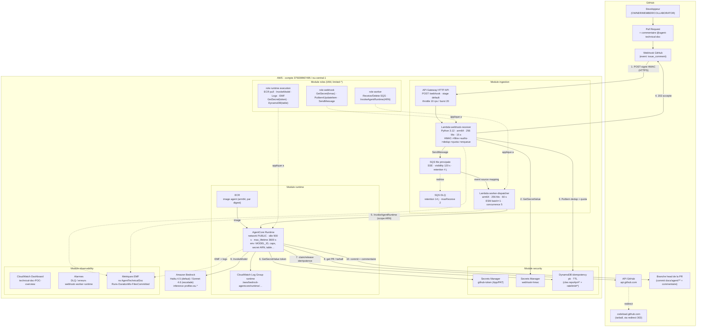
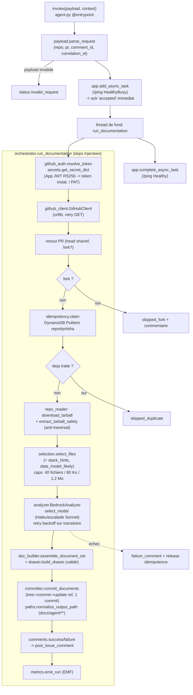

# Architecture — agent-technical-doc

Schémas détaillés de bout en bout : la chaîne d'ingestion (GitHub → AWS), le
pipeline interne de l'agent, et l'inventaire des composants avec leur config.

> Vue synthétique et invariants de sécurité : voir aussi
> `.kiro/specs/agent-technical-doc/design.md`. Audit complet : [`AUDIT.md`](AUDIT.md).

## 1. Vue d'ensemble — chaîne complète

### Légende des flux
1. webhook signé HMAC → 2. lecture secret HMAC → 3. dedup + quota DynamoDB →
4. 202 à GitHub → 5. worker invoque le runtime (ARN scopé) → 6. token GitHub →
7. idempotence (claim/release) → 8. PR + tarball (redirect codeload) →
9. Bedrock (InvokeModel) → 10. commit `docs/agent/**` + commentaire.
Pointillés = logs/métriques EMF + application des rôles IAM.

## 2. Pipeline interne de l'agent (`docagent`)

## 3. Inventaire des composants (config exacte)

| Groupe | Composant | Sous-composants / config |
|--------|-----------|--------------------------|
| **GitHub** | Webhook | event `issue_comment`, Payload URL = API GW, secret HMAC |
| | API GitHub | `api.github.com` (PR, git data, comments), `codeload` (tarball, redirect 302) |
| **Ingestion** | API Gateway | HTTP API, route `POST /webhook`, stage `$default`, throttle 10 rps / burst 20 |
| | Lambda webhook-receiver | Py 3.12 arm64, 256 Mo, 15 s ; `verify_signature`, `evaluate_comment`, `_claim_idempotency`, `_rate_limited`, `_enqueue` |
| | SQS principale | SSE-SQS, visibility 120 s, rétention 4 j, redrive→DLQ (maxReceive 2) |
| | SQS DLQ | rétention 14 j |
| | Lambda worker-dispatcher | arm64, 256 Mo, 60 s, ESM batch=1, concurrence 5 ; classif. transitoire/permanent |
| **Security** | Secrets Manager | `technical-doc-POC-github-token`, `-webhook-hmac` (clés gérées AWS, CMK à venir) |
| | DynamoDB | table idempotence `pk` + TTL ; sert aussi les compteurs `ratelimit#…` |
| **Roles (IAM)** | 3 rôles `limited-*` | webhook / worker / runtime execution — moindre privilège scopé |
| **Runtime** | ECR | image arm64, référencée par digest |
| | AgentCore Runtime | network PUBLIC, idle 900 s, max_lifetime 3600 s, env (MODEL_ID, caps, ARNs) |
| | Log group runtime | `/aws/bedrock-agentcore/runtime/agent-technical-doc-POC` (rétention 14 j) |
| | `docagent` (17 modules) | orchestrator, github_auth, secrets, github_client, repo_reader, selection, analyzer, drawio, doc_builder, committer, comments, idempotency, metrics, paths, payload, retry, config |
| **Bedrock** | Modèles | Haiku 4.5 (défaut) / Sonnet 4.6 (escalade >25 fichiers ou >400 Ko) |
| **Observability** | Dashboard | invocations/erreurs Lambda, SQS vs DLQ, durée de run EMF, runs par outcome |
| | Alarmes | DLQ non vide, erreurs webhook/worker/runtime |
| | EMF | ns `AgentTechnicalDoc` : Runs, DurationMs, FilesCommitted (dim. Agent+Outcome) |

## 4. Invariants clés

- **L'agent ne touche jamais SQS** : SQS relie uniquement webhook-receiver (producteur)
  et worker-dispatcher (consommateur, via event source mapping). L'agent est invoqué
  par `InvokeAgentRuntime` (appel API direct).
- **Le webhook n'a pas le token GitHub** (moindre privilège) : la résolution de PR,
  le clone et la restitution sont faits par l'agent (rôle runtime).
- **Invocation asynchrone** : le worker reçoit un ack immédiat (~1 s) ; l'agent
  travaille en tâche de fond (`add_async_task`/`HealthyBusy`) jusqu'à `max_lifetime`.
- **Cible de commit figée** : `docs/agent/**` sur la branche head, dépôt/sha injectés,
  jamais dérivés du contenu (anti prompt-injection, appliqué par le code).
